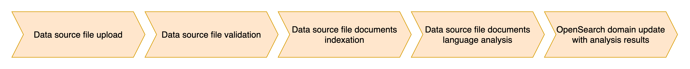
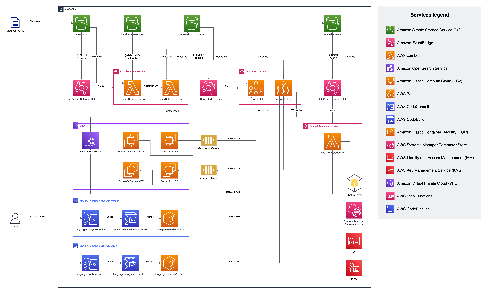

# Language analysis pipeline with text search capabilities

This version of the tool indexes documents and language analysis results in Amazon OpenSearch service, allowing you to efficiently perform text queries and set up visualizations in OpenSearch Dashboards.

The following sections provide an explanation of each of the phases of the analysis, as well as the expected format of the input files. Architectural considerations are also discussed.

## In this page

- [Analysis pipeline](#analysis-pipeline)
- [Architecture diagram](#architecture-diagram)
- [Deployment instructions](#deployment-instructions)

## Analysis pipeline



1. **Data source file upload**: this step starts when files are uploaded to the `data-sources` input bucket. Considerations:
   1. The format of the files must be JSON one line (one JSON document per line).
   2. Each of the documents must contain the following fields: `text`, `country`, `country-code` and `date`. These fields must not be empty.
   3. The format of the `date` field must be `%Y-%m-%d`.
   4. The file size must not exceed 50 MB.
   5. `source` and `id` are reserved field names.
   6. The files must be inside a folder in the input bucket. The root folder is considered as the `source` for the analysis.
2. **Data source file validation**: it is checked that the constraints specified in the previous step are met. In case the validation is successful, it proceeds to step 3. If any of the validation steps fails, the file is moved to the `invalid-data-sources` bucket.
3. **Data source file documents indexation**: each of the documents contained in the input file is hydrated with a unique alphanumeric identifier and the source to which it belongs. Subsequently, the documents are indexed in the OpenSearch domain under the `documents` index and the file with the hydrated documents is uploaded to the `indexed-data-sources` bucket.
4. **Data source file documents language analysis**: a language analysis of the content of the `text` field of each of the documents in the input file is performed. In parallel, the language metrics and errors are analyzed, and the results are uploaded to the `analysis-results` bucket.
5. **OpenSearch domain update with analysis results**: the documents previously indexed in the OpenSearch domain are updated with the results of the language analysis, which are obtained from the `analysis-results` bucket. The language errors are indexed in the `language-errors` index.

## Architecture diagram



### Considerations

- The analysis pipeline is orchestrated by three different AWS Step Functions state machines.
- Two continuous delivery pipelines are created for each part of the language analysis (metrics and errors). The code that performs said analysis is pushed to an AWS CodeCommit repository.
- When pushing changes to the `main` branch, an AWS CodePipeline pipeline automates the process of building and pushing a Docker image to Amazon ECR.
- AWS Batch orchestrates the execution of the language analysis, that runs on a combination of Amazon EC2 On-Demand and Spot instances to reduce costs and execution time.
- The `SystemLayer` Lambda layer contains the [opensearch-py](https://pypi.org/project/opensearch-py/) and [requests](https://pypi.org/project/requests/) Python packages, among others. It also contains the `language_analysis` package located in the `/text-search-capabilities/assets/system_lambda_layer/language_analysis` directory.
- The list of foreignisms that the analyser detects is located in the `/text-search-capabilities/assets/system_config_files/foreignisms.txt` file.
- All architectural components include a `module` tag that indicates the step of the pipeline to which they belong. The possible values are `global-resources`, `data-source-indexation`, `data-source-analysis` and `analysis-results-indexation`.

## Deployment instructions

The following steps assume that you have Python installed in your local machine.

### 1. Installing and configuring the AWS CLI

The AWS Command Line Interface (AWS CLI) is an open source tool that enables you to interact with AWS services using commands in your command-line shell.

- Follow [these steps](https://docs.aws.amazon.com/cli/latest/userguide/getting-started-prereqs.html) to install the AWS CLI on your local machine.
- Follow [these steps](https://docs.aws.amazon.com/cli/latest/userguide/cli-chap-configure.html) to configure the AWS CLI with your AWS account.

### 2. Creating the Service-Linked Role (SLR) for Amazon Elasticsearch

Some OpenSearch cluster configurations require the existence of the `AWSServiceRoleForAmazonElasticsearchService` Service-Linked Role. This SLR is created automatically when performing some operations via the AWS Console, but not when using CloudFormation to deploy the cluster.

If this SLR does not exist in your account, you can create it executing the following command via the AWS CLI:

```bash
aws iam create-service-linked-role --aws-service-name es.amazonaws.com
```

You can read more about it in the [Amazon OpenSearch Service developer guide documentation](https://docs.aws.amazon.com/opensearch-service/latest/developerguide/slr.html).

### 3. Creating a virtual environment and installing project dependencies

After cloning this repository, navigate to the `/automated-language-analysis/text-search-capabilities` directory, and execute the following commands:

#### 3.1 Creating the virtual environment

```python
python3 -m venv .venv
```

#### 3.2 Installing project dependencies in the virtual environment

```python
source .venv/bin/activate
python -m pip install -r requirements.txt
```

### 4. Bootstrapping your AWS account

Deploying AWS CDK apps into an AWS environment may require that you provision resources the AWS CDK needs to perform the deployment. These resources include an Amazon S3 bucket for storing files and IAM roles that grant permissions needed to perform deployments. Execute the following command to bootstrap your environment:

```bash
cdk bootstrap
```

You can read more about this process [here](https://docs.aws.amazon.com/cdk/v2/guide/bootstrapping.html).

### 5. Deploying using CDK

When deploying you need to specify the value for two parameters:

- **language**: language of the data sources to analyse. It has to be one of `ca`, `zh`, `da`, `nl`, `en`, `fr`, `de`, `el`, `it`,
                             `ja`, `lt`, `mk`, `xx`, `nb`, `pl`, `pt`, `ro`, `ru`, `es`. The default value is `en`.
- **analysisMode**: The mode to use when running spaCy. By choosing `Efficiency`, the language analysis will be faster. If you choose `Accuracy`, the results will be more accurate but the analysis will take longer to complete. The default value is `Efficiency`.

```bash
cdk deploy --parameters language=<language> --parameters analysisMode=<analysis_mode>
```

The deployment process will take roughly **35 minutes** to complete.